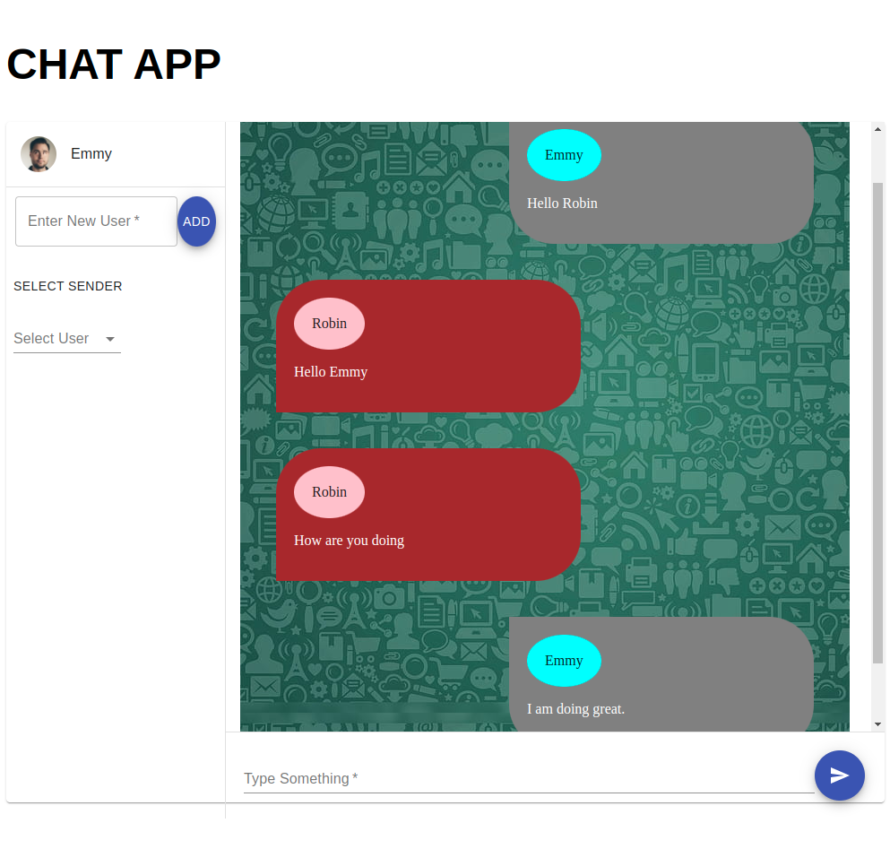
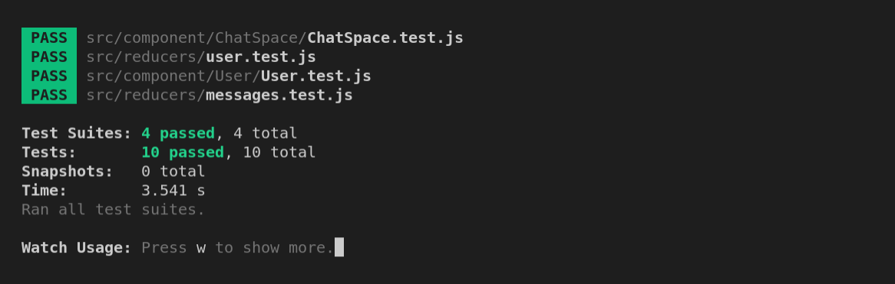

# simple web chat.

> simple web chat is a format that allows customers/users to communicate directly with brands online, often on their websites. The web chat window pops up to add the users as an overlay of the website page in the browser, allowing the user to type messages directly into a text field. the users and mesages are kept in the local storage because there isn't backend developed so far.

You have to add two users (X and Y), when X sends a message the color should be gray and if Y sends the message the color should be red with their corresponding names.

## How it looks

- 

## Built With

- React
- Redux
- Material UI

# Live demo

Visit [this link](https://)

# Getting Started

**To get the local copy of the project up and running you will need to run the following commands on your terminal:**

`git clone https://github.com/Emmyn5600/React-Web-chat.git`

This project was bootstrapped with [Create React App](https://github.com/facebook/create-react-app).

## Available Scripts

In the project directory, you can run:

### `npm start`

Runs the app in the development mode.\
Open [http://localhost:3000](http://localhost:3000) to view it in the browser.

### `npm test`

### `npm build`

Builds the app for production to the `build` folder.\
It correctly bundles React in production mode and optimizes the build for the best performance.

👤 **NSABIMANA Emmanuel**

- GitHub: [@emmyn5600](https://github.com/Emmyn5600)
- Twitter: [@NSABIMA62253884](https://twitter.com/NSABIMA62253884)
- LinkedIn: [@nsabimana-emmanuel-4276091b2](https://www.linkedin.com/in/nsabimana-emmanuel-4276091b2/)

## 🤝 Contributing

Contributions, issues, and feature requests are welcome!

Feel free to check the [issues page](https://github.com/Emmyn5600/React-Web-chat/issues).

## Show your support

Give a ⭐️ if you like this project!❤️

## Acknowledgments

- Byolate Tech

## License

Copyright (c) 2021 [NSABIMANA Emmanuel](emmanuelnsabimana.netlify.app/)
